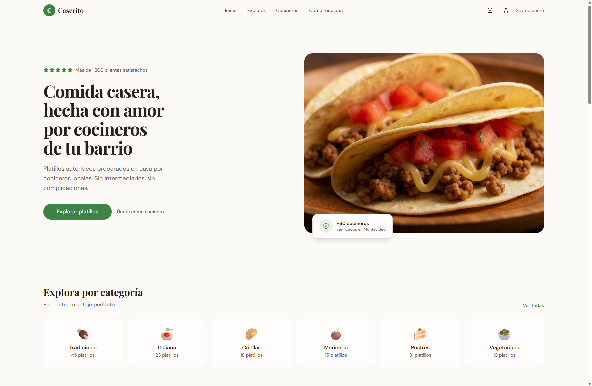

# Gasti's Portfolio

A personal developer portfolio built with React and Vite, inspired by [Gazi Jarin's portfolio](https://gazijarin.com).

## Tech Stack

- **Frontend:** React 18, Vite
- **Styling:** CSS, React Bootstrap
- **Icons:** React Icons (Feather)
- **Animation:** Custom particle portrait, CSS transitions

## Features

- Interactive particle portrait animation
- Typewriter intro effect
- Smooth scroll navigation
- Interactive experience tabs
- Project carousel showcase
- Responsive design for all devices
- Fade-in scroll animations

## Getting Started

# Clone the repository
git clone https://github.com/gastigonzalez1999/gasti-portfolio.git

# Navigate to project
cd gasti-portfolio

# Install dependencies
npm install

# Start development server
npm run dev

# Build for production
npm run build
